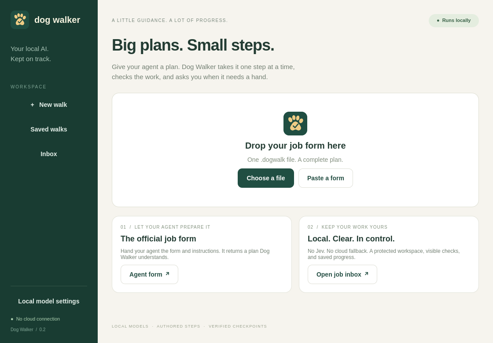

# Dog Walker

Dog Walker is an offline desktop supervisor for local coding models. Give an agent the official job form, import the completed file, choose a project, and start a walk. Dog Walker sends one authored step at a time, checks actual files and tool results, and advances, corrects, or pauses for your review. **No Jev account, API key, or cloud fallback is used.**

Version 0.2 is an early desktop preview, not a standalone installer with bundled models. The native frontend is **QML + Quickshell**, the same toolkit used by the current Omarchy shell. The workflow engine and local Laya inference stay in Python. Bash launchers and an optional QML bar widget provide desktop integration; Omarchy bindings use Lua. There is no Electron or hosted web frontend.



## Start

Open **Dog Walker** from your application menu, or type:

```sh
dog-walker
```

This opens the native desktop app. The installed shortcut on the development Omarchy machine is **Super + Alt + D**; the portable installer does not override other people's keybindings.

1. Click **Agent form**. Give your agent [the handoff instructions](forms/AGENT_HANDOFF.md), [the blank form](forms/JOB_FORM.dogwalk), and your task. The agent returns one completed `.dogwalk` file.
2. Drop it onto the window, choose the file, paste its YAML, or double-click it in your file manager. Files in `~/Documents/Dog Walker/Inbox` appear in the app's inbox automatically.
3. Review the plan and verification commands, then choose the project folder. **Protected copy** requires a clean, committed Git repository. **Current folder** explicitly edits the selected files instead.
4. Press **Start walk**. Auto walk advances checked steps and uses bounded corrections. It still stops for explicit approvals, uncertainty, blockers, and exhausted retries.
5. Use **Approve & continue**, **Retry step**, or **Pause walk** when needed. Saved walks can be resumed without silently replaying a completed turn. **Open results** opens the resulting workspace; changes are not silently merged into the original project.

Importing or depositing a job never executes it. A job can contain powerful commands, so only start forms you trust. Protected copy is a convenience for preserving your checkout, not a security boundary.

The [official schema](forms/job.schema.json) is versioned, rejects unknown fields, and supports inline prompts, acceptance criteria, authored corrections, file/test checks, and optional local-judge questions. [A completed discount-repair example](examples/discount.dogwalk) targets `examples/fixture`; it is not a plan for arbitrary projects. Plain-text form prompts treat dollar signs literally. Written success criteria are instructions, not automated proof; steps without reliable checks require human review.

The terminal interface remains available with `dog-walker demo`. It opens a disposable five-step coding demo: inspect → plan → implement → test → summarize. The first prompt can take a few minutes on a CPU; later turns reuse the same session and model cache.

The final demo checkpoint asks the local judge about completion. Laya may ask for review even when the tests pass; examine the evidence and press **Approve** to accept it. This choice is recorded as manual acceptance. Automatic mode still pauses on uncertainty, blockers, interrupted tools, missing evidence, or exhausted retries.

Other commands:

```sh
dog-walker demo --auto                  # Dashboard, automatic checked steps
dog-walker demo --auto --plain          # Plain output; uncertainty pauses when no terminal input is available
dog-walker new ~/Projects/my-walk       # Create an editable workflow folder
dog-walker validate ~/Projects/my-walk
dog-walker run ~/Projects/my-walk --root /path/to/project
dog-walker runs
dog-walker resume RUN_ID
dog-walker doctor --offline
dog-walker validate-form examples/discount.dogwalk
dog-walker desktop /path/to/completed-job.dogwalk
```

Normally Dog Walker makes a detached Git worktree and leaves your original checkout intact. The source repository must have a commit and no uncommitted files. Use `--in-place` explicitly to work on your current files instead. A run does not commit, merge, deploy, or publish the result. Review and copy or merge the edits yourself. Run history shows the workspace path.

## Write your prompt sequence

`dog-walker new FOLDER` creates a starting prompt, correction prompt, and `workflow.yaml`. Edit them in your editor. Add one Markdown file for each step. Here is a short workflow:

```yaml
version: 1
name: Repair my project
entry: inspect
max_turns: 12
steps:
  - id: inspect
    prompt: steps/01-inspect.md
    retry_prompt: retries/inspect.md
    max_retries: 2
    checks:
      - {id: no-edits-yet, type: no_changes}
      - {id: read-source, type: response_contains, text: app.py}
  - id: implement
    prompt: steps/02-implement.md
    retry_prompt: retries/implement.md
    checks:
      - {id: tests-not-rewritten, type: unchanged, path: test_app.py}
      - id: real-tests-pass
        type: command
        argv: [python3, -m, unittest, -v]
        timeout: 60
```

Steps advance in listed order by default. `on_pass` can name another step, `complete`, or `pause`. `on_exhausted` defaults to `pause` and can name a recovery step. A global turn limit stops circular workflows. `approval: true` always requires your approval, including in automatic mode. `timeout` defaults to 1800 seconds per worker turn. Two correction attempts are allowed by default, for three attempts total.

Available Markdown substitutions are `${project_root}`, `${step_id}`, `${previous_result}`, and `${failed_checks}`. Write `$$` for a literal dollar sign, including shell variable examples. Unknown substitutions and paths outside the workflow folder are rejected.

Deterministic check types:

| Type | Configuration | What it checks |
| --- | --- | --- |
| `command` | `argv`, optional `timeout` | Executes the authored verification command and requires exit 0 |
| `unchanged` | `path` | File checksum matches the start of the run |
| `file_exists` | `path` | Required file exists in the workspace |
| `file_contains` | `path`, `text` | Actual file contains the required text |
| `response_contains` | `text` | Structured worker result contains the text |
| `command_executed` | `text` | A recorded worker command containing this text exited 0 |
| `no_changes` | none | Git reports no tracked or untracked changes, except ignored files |

Author verification commands for your project; a semantic judge cannot prove code works. Commands run as argument arrays within the selected workspace. Choose test tools that are already installed for offline use. Review workflow files before running them because verification commands execute locally.

Optional semantic questions use the local Laya model:

```yaml
    questions:
      ready:
        type: noul
        instructions: Does this agent trace report successful completion of the work?
        expected: true
        threshold: 0.85
```

`noul` checks a true/false statement. `choice` accepts a named `criteria` mapping and `expected` label. `score` accepts an ordered `criteria` list and `minimum` index. Choice/score gates use probability mass on the expected label or permitted score range. Values between the pass and fail thresholds require review. A semantic-only checkpoint always requires human review. A semantic answer cannot override failed files, tests, protected-file checks, or a blocked worker result.

Every turn returns a validated `StepResult`: `status`, `summary`, `evidence`, `files_changed`, and `blockers`. Claims inside that result are evaluated against captured tool events and the authored checks. Laya receives only the short result and check statuses. Overlong or truncated judge input requires review.

## Offline operation and recovery

After setup, the workflow runner, local judge, and model inference require no internet connection. Model requests go to the configured loopback endpoint (the initial profile uses `127.0.0.1:18081`). The judge loads verified local files with Hugging Face and Transformers offline modes enabled. Codex uses its own local provider configuration with cloud apps, web tools, hooks, telemetry, and plugins disabled. Coding tools run with the existing workspace sandbox. The application does not change system-wide network settings; arbitrary job commands are not automatically network-isolated. See [offline/security boundaries](SECURITY.md).

There is an important measured limitation: on the initial 32-case authored synthetic diagnostic, the completion question returned **28 reviews, 4 negative decisions, and no automatic positive decisions** at the conservative 0.85 threshold. There were zero false passes in that small set, but that does not establish general accuracy. Laya is currently helpful as a review gate, not a sole autonomous judge for coding. Workflow-specific tests and file checks provide the strongest automatic checkpoints. We have not tuned thresholds merely to make the demo pass.

**Pause** or `Ctrl+C` stops the running turn and retains partial edits. **Abort** retains files but ends the run. **Retry** uses your correction prompt, and **Edit** lets you replace the next retry prompt. **Skip** is explicit and is recorded; a run with skipped steps is not reported as all steps passing.

When reopening a reviewed step, Dog Walker reruns its checks without resending the completed prompt. An interrupted turn instead needs an explicit retry, because its commands might already have modified files. One lock prevents two walkers from running the same saved run concurrently.

Run data lives at `~/.local/share/dog-walker/runs/RUN_ID/`. Each run holds the copied workflow, event log, snapshots, result files, and worktree. Logs are private local files and redact common credential patterns; they may still contain your project text. The isolated Codex state is in `~/.local/share/dog-walker/codex-home/` and the pinned judge is under `~/.local/share/dog-walker/judge/`. Nothing is written to Obsidian automatically by the app.

## Installation and verification

Prerequisites: Linux, Python 3.14+, Git, Quickshell with Qt Quick Controls/Dialogs, Codex CLI (tested 0.162.0), and a downloaded local model with a compatible llama.cpp **Responses API** server. The installer does not install Codex or a large worker model for you. Ollama/chat-completions-only servers are not a drop-in replacement for this coding harness. CPU dependencies below were recorded on x86-64 Omarchy.

Clone this repository, then install the environment and desktop integration:

```sh
git clone https://github.com/rickndanger-ctrl/dog-walker.git
cd dog-walker
./scripts/install.sh
```

The install downloads software and the small judge checkpoint once. `dog-walker setup-local-judge` verifies the large weight file against the source's SHA-256 and records checksums for every pinned artifact. There are no runtime model downloads. Source: [Laya](https://github.com/NandhaKishorM/laya), checkpoint `convaiinnovations/laya-typed-decisions` at `e929ae5cf69bc34259cd2f95c9e91145b818b1f0`, Apache 2.0. Dependency and model licenses are separate from this app's MIT license; weights are not redistributed here. Codex tool/event integration follows [the non-interactive documentation](https://learn.chatgpt.com/docs/non-interactive-mode) and the installed CLI's actual options.

On a new machine, open **Local model settings** and set the GGUF file, loopback `/v1` endpoint, model catalog, and optional launcher. Saved settings live in `~/.config/dog-walker/worker.json`; they are never embedded in job forms. Empty launcher means use an already-running server. The endpoint must identify the selected model through `/props`. The default profile matches the original Ornith setup; other machines must supply their own paths and server. Python-only package installation is not a standalone desktop distribution: run from this source checkout with its `native/`, `forms/`, and `examples/` folders intact.

The [optional Omarchy widget](omarchy-plugin/README.md) is a quick launcher, not an official Omarchy package. Existing shell and desktop files under `/usr/share/omarchy` are not modified.

```sh
.venv/bin/python -m pytest -q
unshare -Urn .venv/bin/python scripts/evaluate_judge.py
unshare -Urn .venv/bin/python scripts/offline_acceptance.py
# Optional: rendered desktop + real worker, using your running local server
.venv/bin/python scripts/desktop_acceptance.py
```

The acceptance script runs Ornith, Codex tools, and Dog Walker inside a network namespace with loopback only, confirms that connecting to an external IP fails, and drives the actual coding fixture. Its report is in `artifacts/offline-acceptance.json`. If the final semantic gate pauses, `scripts/offline_acceptance.py --resume RUN_ID` provides a separately recorded **scripted test approval** after verified checks pass and asserts that no completed worker turn was replayed. This test-only approval is never part of the application.

The separate desktop acceptance harness renders a temporary copy of the actual QML interface, imports the official completed example, invokes its Start/Pause/Resume/Approve button handlers, and checks a real Ornith job plus reopen without replay. It uses isolated disposable run data and an already-running loopback server. Its final approval is explicitly scripted for testing; this harness does not disable the host's external network. Private artifacts and model weights are excluded from Git. Selected verification summaries are in [docs/verification](docs/verification/).

To remove the application later, remove its launcher and project environment. Preserve the data folder if you want saved runs. Git worktrees should be removed using Git from their source repositories after saving wanted edits.
